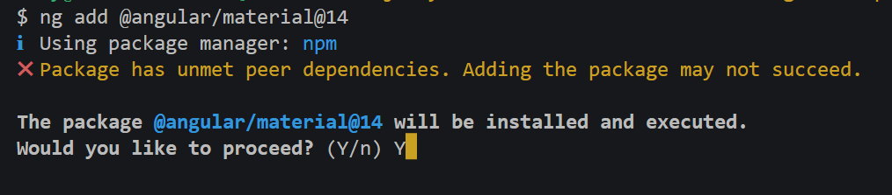
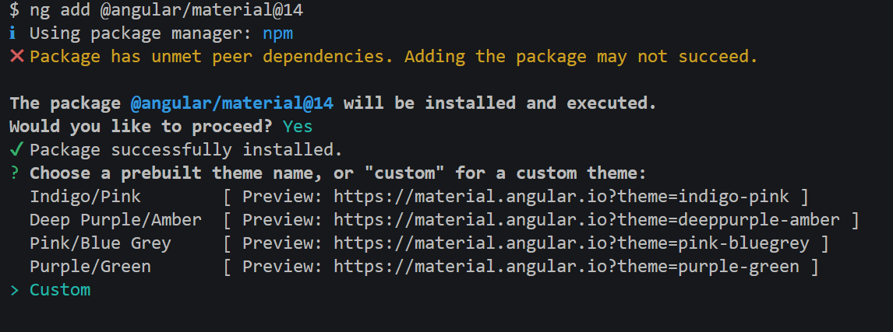
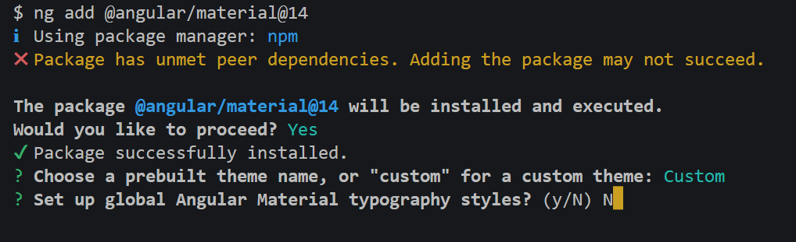
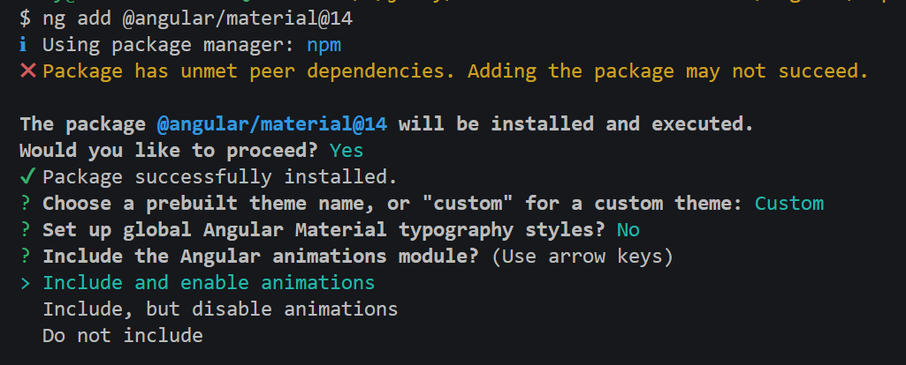

# Curso Angular 15 Mitocode

Este es un repositorio que se basaa en la versión 15 de Angular, tengan en cuenta que las librerías que usemos pueden cambiar su implementación en el tiempo, asi que deben de adaptar el proyecto de acuerdo a esos cambios.

## Angular Material

Antes de instalar Angular material, asegurate de seleccionar la versión correcta según la versión de Angular de tu proyecto, en nuestro caso usaremos la versión 15:

```
ng add @angular/material
```

Cuando empieze a instalar nos arrojara un mensaje confirmando la versión de angular material, indicamos **Y** (las imagenes son de la versión 14 pero se mantiene las mismas opciones para la versión 15)



Cuando se muestre la opción de escoger un tema, nosotros usaremos la opción **"custom"**



Cuando se muestre la opción de usar la typografia diremos que **NO**



y por ultimo nos pedira si usaremos browser animation, le diremos _Include and enabled animations_:



## Migracion TSLint a ESLint Angular < v12

Recuerda que estos pasos solo aplica a las versiones que estan antes de la versión 12, ya que esas versiones usaban TSLint y generaban un archivo llamado **_tslint.json_**.

Ejecuta el siguiente comando en tu consola

```
ng add @angular-eslint/schematics
ng g @angular-eslint/schematics:convert-tslint-to-eslint --remove-tslint-if-no-more-tslint-targets --ignore-existing-tslint-config
```

Cuando termine de ejecutar esos comandos ya puedes eliminar el archivo **_tslint.json_**.

## Instalación EsLint Angular >= v12

Esta configuración solo aplica si usas angular versión 12 o superior.

```
ng add @angular-eslint/schematics
```

más información en: https://github.com/angular-eslint/angular-eslint

## Code Quality

1. Prettier
2. eslint-config-prettier
3. eslint-plugin-prettier

Ejecuta el siguiente comando en tu consola

```
npm install -D prettier eslint-config-prettier eslint-plugin-prettier
```

Luego dentro de tu archivo .eslinttrc.json agrega lo siguiente en la sección **extends** de las configuraciones para los archivos **.ts**
Configuración para los archivos TS:

```json
    		"extends": [
				"plugin:@angular-eslint/recommended",
                "plugin:@angular-eslint/template/process-inline-templates",
                "plugin:prettier/recommended"
			]
```

Tambien agregaras enla configuraciones para los archivos **.ts** lo siguiente:

```json
"parserOptions": {
				"project": ["tsconfig.json"]
			},
```

Ahi mismo agregaremos unas reglas de exclusión en la sección de **rules**:

```json
		"rules": {
				"@angular-eslint/directive-selector": [
					"error",
					{
						"type": "attribute",
						"prefix": "app",
						"style": "camelCase"
					}
				],
				"@angular-eslint/component-selector": [
					"error",
					{
						"type": "element",
						"prefix": "app",
						"style": "kebab-case"
					}
				],
				"@typescript-eslint/unbound-method": [
					"error",
					{
						"ignoreStatic": true
					}
				],
				"@typescript-eslint/explicit-module-boundary-types": ["error"],
				"@typescript-eslint/no-non-null-assertion": "off"
			}
```

Configuración para los archivos HTML:

```json
	"extends": [
		  "plugin:@angular-eslint/template/recommended",
      	  "plugin:prettier/recommended"
			],
```

**LISTADO DE REGLAS PARA TYPESCRIPT EN: https://typescript-eslint.io/rules/**

## Configurar archivos Prettier

Debes de crear los siguientes archivos en la raíz de tu proyecto:

1. .prettierrc
2. .prettierignore

dentro del archivo **.prettierrc** coloca lo siguiente:

```json
{
	"arrowParens": "always",
	"bracketSpacing": true,
	"insertPragma": false,
	"printWidth": 120,
	"proseWrap": "preserve",
	"quoteProps": "as-needed",
	"requirePragma": false,
	"semi": true,
	"singleQuote": true,
	"tabWidth": 2,
	"trailingComma": "none",
	"useTabs": true,
	"endOfLine": "auto"
}
```

Para evitar formatear algunos archivos podemos hacer uso del archivo **.prettierignore**, agrega lo siguiente:

```console
node_modules/*
package-lock.json
yarn.lock
src/*.ts
src/index.html
```

Recuerda que puedes configurar los atributos a tu gusto, más información en https://prettier.io/playground/

Dentro tu archivo **package.json** existe una sección llamada **scripts**, dentro agregaras lo siguiente:

```json
"format": "prettier --write \"./src/**/*.{ts,json,html,scss}\""
```

## Configurar Husky

Husky nos ayudara a verificar nuestros cambios de git, más información en:
https://typicode.github.io/husky/#/

Ejecuta el siguiente comando:

```console
npx husky-init && npm install
```

Esto creara una carpeta llamada **".husky"**, dentro de esta carpeta existe un archivo llamado **pre-commit**, dentro agregaras lo siguiente:

```console
npm run pre-commit
```

y luego agregaras los siguientes scripts en tu **package.json** en la sección de **scripts** :

```json
"lint-format": "npm run format &&  ng lint --fix",
"pre-commit": "npm run lint-format && git add ."
```

## Formatear solo los archivos modificados

Para poder formater unicamente los archivos modificados usaremos la librería **pretty-quick**

```console
npm i -D pretty-quick
```

Ahora debemos de modificar nuestro archivo **pre-commit** con lo siguiente:

```console
npx pretty-quick --pattern "src/**/**.ts" --pattern "src/**/**.json" --pattern "src/**/**.html"  --pattern "src/**/**.scss"  --staged --verbose && ng lint --fix
```

# Librerías extras

## jwt-decode

Esta librería nos servira para poder decodificar nuestro JWT

Instalamos la librería

```console
npm i jwt-decode
```

## costlydeveloper/ngx-awesome-popup

Esta librería nos servira para poder enviar notificaciones al usuario, tienes muchos efectos y la puedes personalizar a tu gusto, más información en https://costlydeveloper.github.io/ngx-awesome-popup/#/playground/toast-generator

Instalamos la librería

```console
npm i @costlydeveloper/ngx-awesome-popup
```

Para usar los estilos agregaremos lo siguiente en el archivo **style.scss**

```css
@import 'node_modules/@costlydeveloper/ngx-awesome-popup/styles/theme';
```

Tambien agregaremos unos cambios al archivo **angular.json** para que el archivo sea parte de la compilación de nuestro proyecto:

```json

 "styles": [
              "src/styles.scss",
              "node_modules/@costlydeveloper/ngx-awesome-popup/styles/theme.css"
            ]
```

## ngx-ui-loader

Esta librería nos servira para podr mostrar un "Loader" cada vez que se haga una peticíon http, la puedes usar para lo que necesites; más información en : https://www.npmjs.com/package/ngx-ui-loader

```console
npm i ngx-ui-loader
```

## PdfMaker

Esta librería nos permite crear archivos PDF, más información en https://pdfmakewrapper.org/

instalamos las siguientes librerías:

```console
npm i pdfmake@0.1.72 pdfmake-wrapper
```

```console
npm i -D @types/pdfmake
```

## exceljs

Esta librería nos permite crear archivos excel, más información en https://www.npmjs.com/package/exceljs

```console
npm i exceljs file-saver
```

```console
npm i -D @types/file-saver
```

## ngx-charts

Esta librería nos permite crear graficos estadisticos, más información en https://swimlane.gitbook.io/ngx-charts/

```console
npm i @swimlane/ngx-charts
```

```console
npm i -D @types/d3-scale @types/d3-selection @types/d3-shape
```
